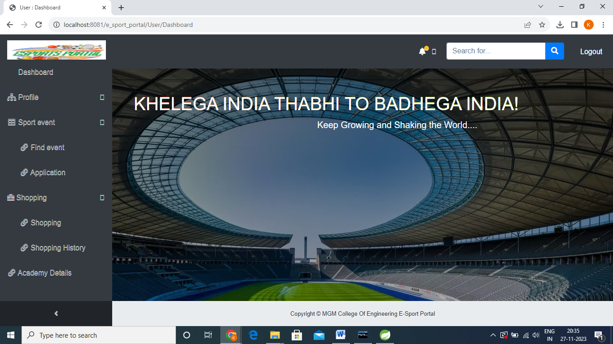
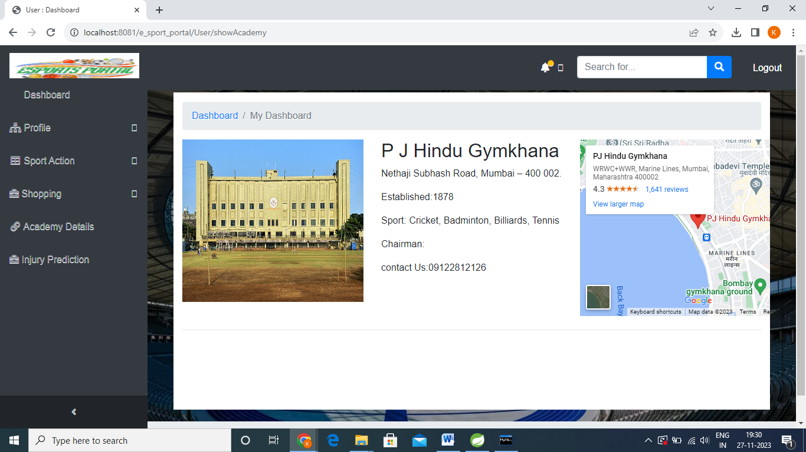
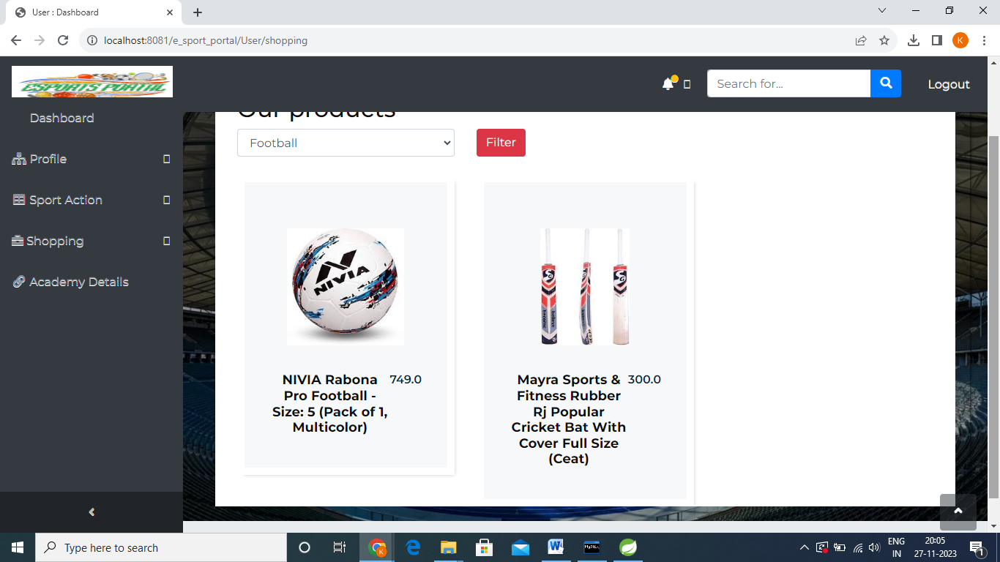
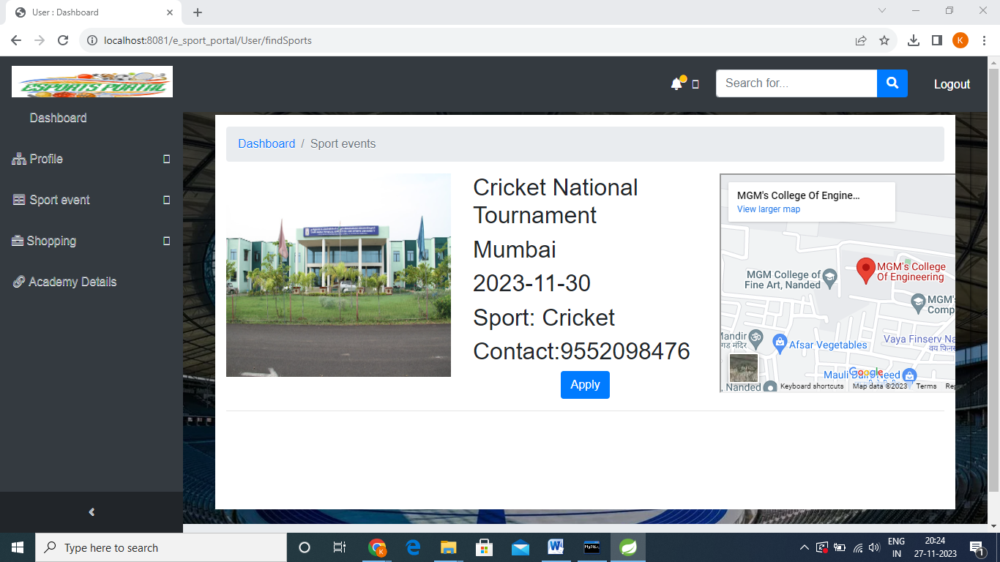

<h1 align=center>E-sport Portal</h1>

E-sport Portal is a dynamic web application tailored for sports enthusiasts and event managers. It offers an interactive platform for users to seamlessly gather comprehensive information about sports, providing a flexible experience for enthusiasts and efficient event management tools for organizers.

Built using:
- **Frontend:** HTML, CSS, JavaScript
- **Backend:** Java with Spring Boot

## Features

- <b> User Dashboard : </b> Explore details of sports academy, buy favorite sports, and manage participation in events.
  <br>
  <br>
  

- <b> Event Manager Dashboard : </b> Efficiently organize and manage sports events, review applications, and communicate with participants.
  <br>
  <br>
  

- <b> Admin Dashboard : </b> Centralized control for administrators to oversee the entire platform, manage user accounts, and monitor event statistics and manage products and academy details.
  <br>
  <br>
  

- <b>Sports Academy Information :</b> User can explore details about different sports academies.
  <br>
  <br>
  

- <b> E-commerce Integration :</b>
  Purchase sports equipment directly through the portal.
  <br>
  <br>
  
- <b> Event Notifications : </b> Receive timely notifications about upcoming events and tournaments via email or SMS.
  <br>
  <br>
  

<h2> Installation </h2>

Follow these steps to set up and run the E-sport Portal locally:

### Prerequisites

Ensure you have the following tools installed on your machine:

- [Java](https://www.oracle.com/java/technologies/javase-downloads.html)
- [Maven](https://maven.apache.org/download.cgi)
- [Git](https://git-scm.com/book/en/v2/Getting-Started-Installing-Git)

1. Clone the repository:

   ```bash
   git clone https://github.com/your-username/your-repository.git

2. Navigate to the project directory:

   ```bash
       cd your-repository
   
3. Build the project:

   ```bash
        ./mvnw clean install
If you're using Windows, use mvnw.cmd instead.

<h2> Running the Application </h2>

Run the application:

         ./mvnw spring-boot:run
Alternatively, run the generated JAR file:

         java -jar target/your-application.jar
Replace your-application.jar with the actual JAR file name generated by Maven.
Access the application in your web browser at http://localhost:8080 or another port if configured differently.
